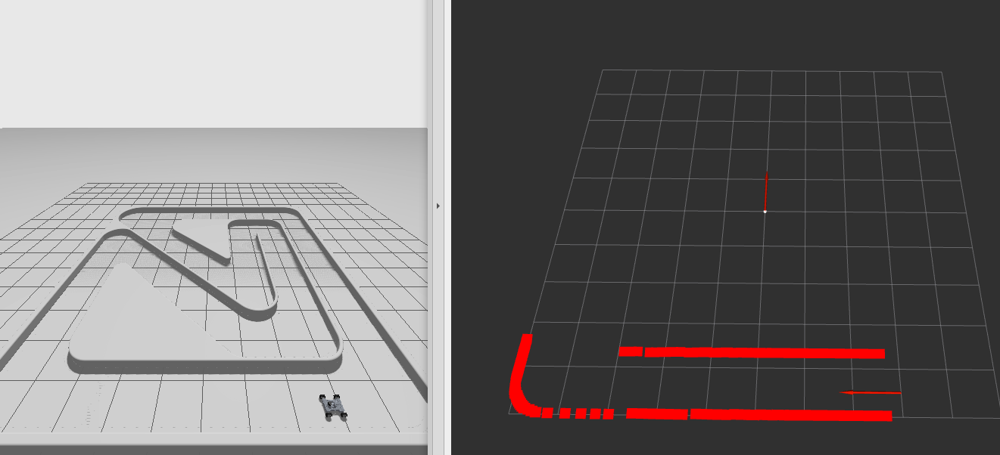

# robotverseny

[](https://docs.ros.org/en/humble/)



## Clone 

``` bash
cd ~/ros2_ws/src
```

``` bash
git clone https://github.com/rudolfkrecht/robotverseny
```

## Build

``` bash
cd ~/ros2_ws
```

``` bash
colcon build --symlink-install --packages-select robotverseny_application robotverseny_description robotverseny_bringup robotverseny_gazebo 
```

## Run


``` bash
export IGN_GAZEBO_RESOURCE_PATH=~/ros2_ws/install/robotverseny_gazebo/share/robotverseny_gazebo/worlds:~/ros2_ws/install/robotverseny_description/share:${IGN_GAZEBO_RESOURCE_PATH}
```

``` bash
export IGN_GAZEBO_MODEL_PATH=~/ros2_ws/src/robotverseny/robotverseny_description/models:${IGN_GAZEBO_MODEL_PATH}
```


``` bash
source ~/ros2_ws/install/setup.bash
```

``` bash
ros2 launch robotverseny_bringup roboworks.launch.py
```

> [!WARNING]  
> The command `export IGN_GAZEBO_RESOURCE_PATH=` or `export IGN_GAZEBO_MODEL_PATH=` will delete your previous paths.


## Check your paths

``` bash 
echo $IGN_GAZEBO_RESOURCE_PATH
```

``` bash 
echo $IGN_GAZEBO_MODEL_PATH
```

## Gazebo related

> [!TIP]
> Gazebo Fortress: [gazebosim.org/docs/fortress/install_ubuntu](https://gazebosim.org/docs/fortress/install_ubuntu), read more about integration: [gazebosim.org/docs/fortress/ros2_integration](https://gazebosim.org/docs/fortress/ros2_integration)
> `ros-gz-bridge` install with a single command: `sudo apt install ros-humble-ros-gz-bridge`